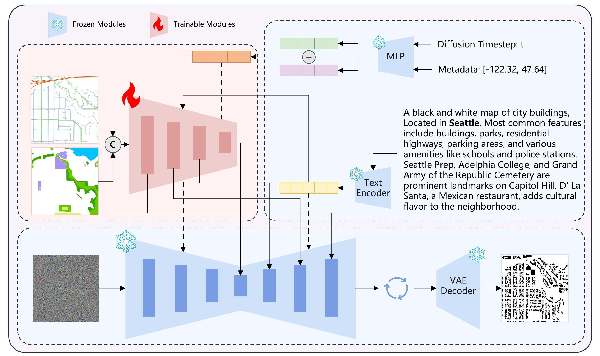

<div align="center">
<h1>From geometric mimicry to comprehensive generation: a context-informed multimodal diffusion model for urban morphology synthesis</h1>


[Fangshuo Zhou](https://www.researchgate.net/profile/Fangshuo-Zhou)<sup>†</sup> · Huaxia Li<sup>†</sup> · Rui Hu · Sensen Wu · Liang Xu

Hailin Feng · Zhenhong Du · [Liuchang Xu](https://www.researchgate.net/profile/Liuchang-Xu)<sup>*</sup>

<sup>*</sup>Corresponding authors <sup>†</sup>Equal contribution

[](http://arxiv.org/abs/2409.17049)
[](https://www.tandfonline.com/doi/full/10.1080/13658816.2026.2639026)


</div>



## 📢 News
2026-02-25: Our paper has been accepted by the [*International Journal of Geographical Information Science*](https://www.tandfonline.com/doi/full/10.1080/13658816.2026.2639026). The model is available on [Figshare](https://doi.org/10.6084/m9.figshare.30103996). <br>
2024-09-26: Added the preprint to arxiv <a href="http://arxiv.org/abs/2409.17049"></a>. <br>
2024-09-24: We uploaded sample data for visitors to perform inference with the model. <br>
2024-09-19: ~~We uploaded the model to HuggingFace <a href="https://huggingface.co/fangshuoz/ControlCity"></a>.~~ <br>
2024-09-13: ControlCity official github repository is officially created.

## 📦 Repository
Clone the repository (requires git):
```bash
git clone https://github.com/fangshuoz/ControlCity.git

pip install -r requirements.txt
```

## 🚀 Quickstart

```python
from PIL import Image
from controlcity import (
    OSMControlNetModel,
    DiffusionOSMControlnetPipeline,
    metadata_normalize,
    convert_binary,
)
from diffusers import UniPCMultistepScheduler
import torch

# load pipeline
controlnet = OSMControlNetModel.from_pretrained(
    trained_controlnet_model_path,
    torch_dtype=torch.float16, use_safetensors=True,
    low_cpu_mem_usage=False, device_map=None
)
pipe = DiffusionOSMControlnetPipeline.from_pretrained(
    sdxl_model_path,
    controlnet=controlnet,
    torch_dtype=torch.float16,
    use_safetensors=True,
)
pipe.load_lora_weights(
    trained_lora_model_path,
)
pipe.scheduler = UniPCMultistepScheduler.from_config(pipe.scheduler.config)
pipe.to('cuda:1')

# load condition(text, metadata, cond_image, etc.)
metadata = [-122.3382568359375, 47.61727258456622]
prompt = "A black and white map of city buildings, Located in Seattle, Mostly urban area with numerous buildings, parking lots, ..."
image_road = Image.open('road/15/Seattle/5248_11443.png').convert("RGB")
image_landuse = Image.open('landuse/15/Seattle/5248_11443.png').convert("RGB")

metadata = metadata_normalize(metadata).tolist()

# inference
image = pipe(
    prompt=prompt,
    metadata=metadata,
    negative_prompt="Low quality.",
    image_road=image_road,
    image_landuse=image_landuse,
    guidance_scale=5.0,
    num_inference_steps=25,
    generator=torch.manual_seed(42)
).images[0]

image_bin = convert_binary(image, thr=60, mode="RGB", image_landuse=image_landuse)[0]
```

## 📝 Citation

If you find this work useful for your research, please consider citing:

```bibtex
@article{Zhou12032026,
    author = {Fangshuo Zhou and Huaxia Li and Liuchang Xu and Rui Hu and Sensen Wu and Liang Xu and Hailin Feng and Zhenhong Du},
    title = {From geometric mimicry to comprehensive generation: a context-informed multimodal diffusion model for urban morphology synthesis},
    journal = {International Journal of Geographical Information Science},
    volume = {0},
    number = {0},
    pages = {1--36},
    year = {2026},
    publisher = {Taylor \& Francis},
    doi = {10.1080/13658816.2026.2639026},
    URL = {[https://doi.org/10.1080/13658816.2026.2639026](https://doi.org/10.1080/13658816.2026.2639026)},
    eprint = {[https://doi.org/10.1080/13658816.2026.2639026](https://doi.org/10.1080/13658816.2026.2639026)}
}
```
